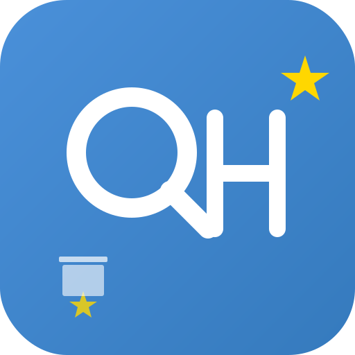
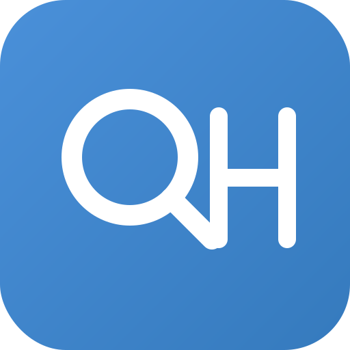
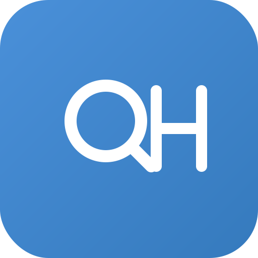
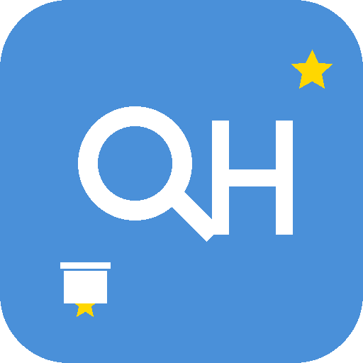

# 题小助 图标使用说明

**项目名称**：题小助 (QuestionHelper)  
**版本**: V1.0  
**日期**: 2026-05-29  
**作者**: UI设计师

---

## 📁 图标文件清单

### 1. App 图标预览

| 变体 | 预览 | 说明 | 用途 |
|------|------|------|------|
| 标准版 |  | QH 字母 + 金色星星 + 小书本 | 主要图标 |
| 简化版 |  | 纯 QH 字母，无装饰 | 小尺寸场景 |
| IP 形象 |  | 题小助吉祥物 | ⭐ 推荐 App 图标 |
| 圆形版 |  | IP 形象 + 圆形背景 | 社交媒体头像 |
| 极简版 |  | 最简 QH 字母 | 水印、文档 |

> **注意**：以上 SVG 图标均有对应的 PNG 版本，共 17 种尺寸 x 5 种变体 = 85 个 PNG 文件。

### 1.1 App 图标 PNG 文件

已生成 17 个尺寸的 PNG 文件，每个尺寸 5 个变体：

| 尺寸 | 用途 | 文件命名格式 |
|------|------|-------------|
| 16×16 | 小图标 | `app-icon-{variant}-16.png` |
| 32×32 | Favicon | `app-icon-{variant}-32.png` |
| 48×48 | Windows 快捷方式 | `app-icon-{variant}-48.png` |
| 64×64 | 高 DPI 屏幕 | `app-icon-{variant}-64.png` |
| 72×72 | Google TV | `app-icon-{variant}-72.png` |
| 76×76 | iPad | `app-icon-{variant}-76.png` |
| 87×87 | iPhone @3x | `app-icon-{variant}-87.png` |
| 96×96 | 通用 | `app-icon-{variant}-96.png` |
| 120×120 | iPhone @2x | `app-icon-{variant}-120.png` |
| 128×128 | Chrome Web Store | `app-icon-{variant}-128.png` |
| 144×144 | Android/Windows | `app-icon-{variant}-144.png` |
| 152×152 | iPad @2x | `app-icon-{variant}-152.png` |
| 167×167 | iPad Pro | `app-icon-{variant}-167.png` |
| 180×180 | iPhone/Android | `app-icon-{variant}-180.png` |
| 192×192 | Android Chrome | `app-icon-{variant}-192.png` |
| 512×512 | PWA/Play Store | `app-icon-{variant}-512.png` |
| 1024×1024 | App Store | `app-icon-{variant}-1024.png` |

变体 (variant): `standard`(标准), `simple`(简化), `mascot`(IP形象), `circle`(圆形), `minimal`(极简)

### 2. Favicon

| 文件名 | 说明 | 用途 |
|--------|------|------|
| `favicon.svg` | Favicon SVG 图标 | 浏览器标签页（矢量） |
| `favicon-16x16.svg` | 16x16 简化 SVG | 小尺寸 Favicon |
| `favicon.ico` | 多尺寸 ICO 文件 | 传统浏览器兼容 |
| `favicon-16x16.png` | 16px PNG | 小图标 |
| `favicon-32x32.png` | 32px PNG | 标准 Favicon |
| `favicon-48x48.png` | 48px PNG | Windows 标签 |
| `favicon-64x64.png` | 64px PNG | 高 DPI |
| `favicon-128x128.png` | 128px PNG | Chrome Web Store |
| `favicon-180x180.png` | 180px PNG | Apple Touch Icon |
| `favicon-192x192.png` | 192px PNG | Android Chrome |
| `favicon-512x512.png` | 512px PNG | PWA |
| `favicon-1024x1024.png` | 1024px PNG | 高清显示 |
| `题小助-Favicon设计.md` | Favicon设计规范 | 设计文档 |

### 3. 品牌设计

| 文件名 | 说明 | 用途 |
|--------|------|------|
| `题小助-品牌风格设计文档.md` | 品牌风格文档 | 品牌规范 |
| `题小助-Favicon设计.md` | Favicon 设计规范 | Favicon 设计参考 |
| `题小助-图标使用说明.md` | 图标使用说明 | 本文档 |

---

## 🎨 图标设计说明

### 标准版图标 (app-icon.svg)



设计特点：
- **QH 字母组合** — Q = Question（题目），H = Helper（助手）
- **装饰元素** — 金色小星星（顶部 + 底部）、蓝色小书本（左下角）
- **色彩** — 背景：`#4A90D9` → `#357ABD` 渐变，文字：白色

### IP形象图标 (app-icon-mascot.svg)


设计特点：
- **题小助卡通形象** — 大眼睛（聪明可爱）、学士帽（学习属性）、招手 + 拿书（亲切助手）
- **表情** — 微笑、腮红、眉毛，友好亲切
- **色彩** — 背景：`#4A90D9` 渐变，脸部：`#FFE4C4` 肤色，帽子：`#2C3E50` 深蓝

---

## 🔧 如何使用

### 1. 转换为 PNG 格式

#### 方法一：使用在线工具

1. 访问 [SVG to PNG](https://svgtopng.com/)
2. 上传 SVG 文件
3. 选择尺寸（512x512, 1024x1024等）
4. 下载 PNG 文件

#### 方法二：使用命令行

```bash
# 安装 ImageMagick
brew install imagemagick

# 转换 SVG 到 PNG
convert app-icon.svg -resize 512x512 app-icon-512.png
convert app-icon.svg -resize 1024x1024 app-icon-1024.png

# 转换 Favicon
convert favicon.svg -resize 32x32 favicon-32x32.png
convert favicon.svg -resize 16x16 favicon-16x16.png
```

#### 方法三：使用 Figma

1. 导入 SVG 文件到 Figma
2. 调整尺寸
3. 导出为 PNG

#### 方法四：使用 Python Pillow（推荐，项目实际使用）

```python
from PIL import Image, ImageDraw

# 生成指定尺寸的 PNG
img = Image.new("RGBA", (512, 512), (0, 0, 0, 0))
draw = ImageDraw.Draw(img)
# ... 绘制逻辑 ...
img.save("app-icon-512.png")
```

说明：本项目的所有 PNG 资源均使用 Pillow 程序化生成，确保像素精确。

### 2. 生成 ICO 格式

```bash
# 使用 ImageMagick 生成 ICO
convert favicon-16x16.png favicon-32x32.png favicon.ico

# 或使用在线工具
# https://www.icoconverter.com/
```

### 3. 生成多尺寸 PNG

```bash
# 生成所有需要的尺寸
for size in 16 32 48 64 128 180 192 512; do
  convert app-icon.svg -resize ${size}x${size} app-icon-${size}.png
done
```

---

## 📱 各平台尺寸要求

### iOS

| 用途 | 尺寸 | 文件名 |
|------|------|--------|
| App Store | 1024x1024 | app-icon-1024.png |
| iPhone | 180x180 | apple-touch-icon-180.png |
| iPad | 167x167 | apple-touch-icon-167.png |
| Spotlight | 120x120 | apple-touch-icon-120.png |
| Settings | 87x87 | apple-touch-icon-87.png |

### Android

| 用途 | 尺寸 | 文件名 |
|------|------|--------|
| Play Store | 512x512 | app-icon-512.png |
| xxxhdpi | 192x192 | android-xxxhdpi.png |
| xxhdpi | 144x144 | android-xxhdpi.png |
| xhdpi | 96x96 | android-xhdpi.png |
| hdpi | 72x72 | android-hdpi.png |
| mdpi | 48x48 | android-mdpi.png |

### Web

| 用途 | 尺寸 | 文件名 |
|------|------|--------|
| Favicon | 32x32 | favicon-32x32.png |
| Favicon | 16x16 | favicon-16x16.png |
| Apple Touch | 180x180 | apple-touch-icon.png |
| Android Chrome | 192x192 | android-chrome-192.png |
| Android Chrome | 512x512 | android-chrome-512.png |

### 4.1 资源目录结构

```
assets/
├── app-icon.svg                 # 标准版 SVG 源文件
├── app-icon-simple.svg          # 简化版 SVG
├── app-icon-mascot.svg          # IP形象 SVG
├── app-icon-circle.svg          # 圆形版 SVG
├── app-icon-minimal.svg         # 极简版 SVG
├── favicon/
│   ├── favicon.svg              # Favicon SVG
│   ├── favicon-16x16.svg        # 16x16 简化 SVG
│   ├── favicon.ico              # 多尺寸 ICO
│   └── favicon-{size}x{size}.png # 各尺寸 PNG
├── backend/                     # 后端（管理后台）图片资源
│   ├── README.md                # 说明文档
│   ├── logo.png                 # 导航栏 Logo
│   ├── logo-sm.png              # 折叠态 Logo
│   ├── login-bg.png             # 登录页背景
│   ├── login-illustration.png   # 登录页插画
│   ├── default-avatar.png       # 默认头像
│   ├── 401.png                  # 无权限错误页
│   ├── 404.png                  # 页面未找到错误页
│   └── favicon.svg              # 浏览器标签图标
└── mobile/                      # 移动端图片资源
    ├── README.md                # 说明文档
    ├── logo.png                 # 移动端 Logo
    ├── splash-icon.png          # 启动页图标
    ├── tabbar/                  # 底部导航栏图标 (10个)
    ├── icons/                   # 功能图标 (25个)
    ├── empty/                   # 空状态图 (7个)
    ├── error/                   # 错误页图 (3个)
    ├── status/                  # 状态图标 (4个)
    ├── defaults/                # 默认占位图 (3个)
    └── banners/                 # Banner 图 (3个)
```

总计：**180+ 个文件** — 5 SVG + Favicon + App 图标 PNG + 后端 8 个文件 + 移动端 55 个文件

---

## 🎯 使用场景

### 1. App 图标 — ⭐ 推荐 IP 形象


**推荐使用**：`app-icon-mascot.svg`（IP形象）

原因：
- ✅ 有辨识度 — 独特 IP 形象，不会和其他 App 混淆
- ✅ 可爱亲切 — 符合品牌"亲切、可爱、专业"调性
- ✅ 容易记住 — 有表情有故事，用户看了就记住
- ✅ 适合社交传播 — 分享时展示可爱形象

### 2. 网站 Favicon


**推荐使用**：`favicon.svg`

原因：
- ✅ 简洁清晰 — 小尺寸下 QH 字母仍可读
- ✅ 专业感 — 蓝色背景 + 白色字母，干净利落
- ✅ 矢量缩放 — SVG 在任何尺寸都清晰

### 3. 社交媒体头像


**推荐使用**：`app-icon-circle.svg`（圆形版）

原因：
- ✅ 适合圆形裁剪 — 圆形背景天然适配
- ✅ IP形象突出 — 题小助形象一目了然
- ✅ 社交友好 — 朋友圈、微博头像效果好

### 4. 文档/水印


**推荐使用**：`app-icon-minimal.svg`（极简版）

原因：
- ✅ 不喧宾夺主 — 最简线条，不影响正文
- ✅ 简洁大方 — 干净专业
- ✅ 适合小尺寸 — 16px 仍清晰

---

## 💻 代码中引用图标

### 管理后台 (Vue 3 + Vite)

```vue
<!-- public 目录下的文件通过根路径引用 -->


<!-- src/assets 下的文件通过别名引用 -->

```

### 移动端 (UniApp)

```vue
<!-- static 目录下的文件通过绝对路径引用 -->
<image src="/static/images/logo.png" />

<!-- TabBar 图标在 pages.json 中配置 -->
"tabBar": {
  "list": [{
    "iconPath": "static/images/tabbar/home.png",
    "selectedIconPath": "static/images/tabbar/home-active.png"
  }]
}
```

---

## 📋 快速参考

### 品牌色

| 颜色 | 色值 | 用途 |
|------|------|------|
| 主色 | #4A90D9 | 背景、按钮 |
| 主色-深 | #357ABD | 渐变 |
| 肤色 | #FFE4C4 | IP形象脸部 |
| 帽子色 | #2C3E50 | 学士帽 |
| 金色 | #FFD700 | 装饰、星星 |
| 红色 | #E74C3C | 书本 |

### 字体

| 用途 | 字体 | 字重 |
|------|------|------|
| QH文字 | SF Pro Display | Bold (700) |
| 中文 | PingFang SC | Medium (500) |

---

## 💡 设计建议

### ✅ 推荐

- 使用标准蓝色渐变背景
- 保持 QH 文字清晰可读
- IP形象保持可爱亲切
- 小尺寸使用简化版

### ❌ 避免

- 不要改变品牌色
- 不要扭曲比例
- 不要添加过多细节
- 不要在深色背景上使用深色图标

---

## 📞 联系方式

如有设计问题，请在项目 Issue 中反馈。

---

**文档结束**
